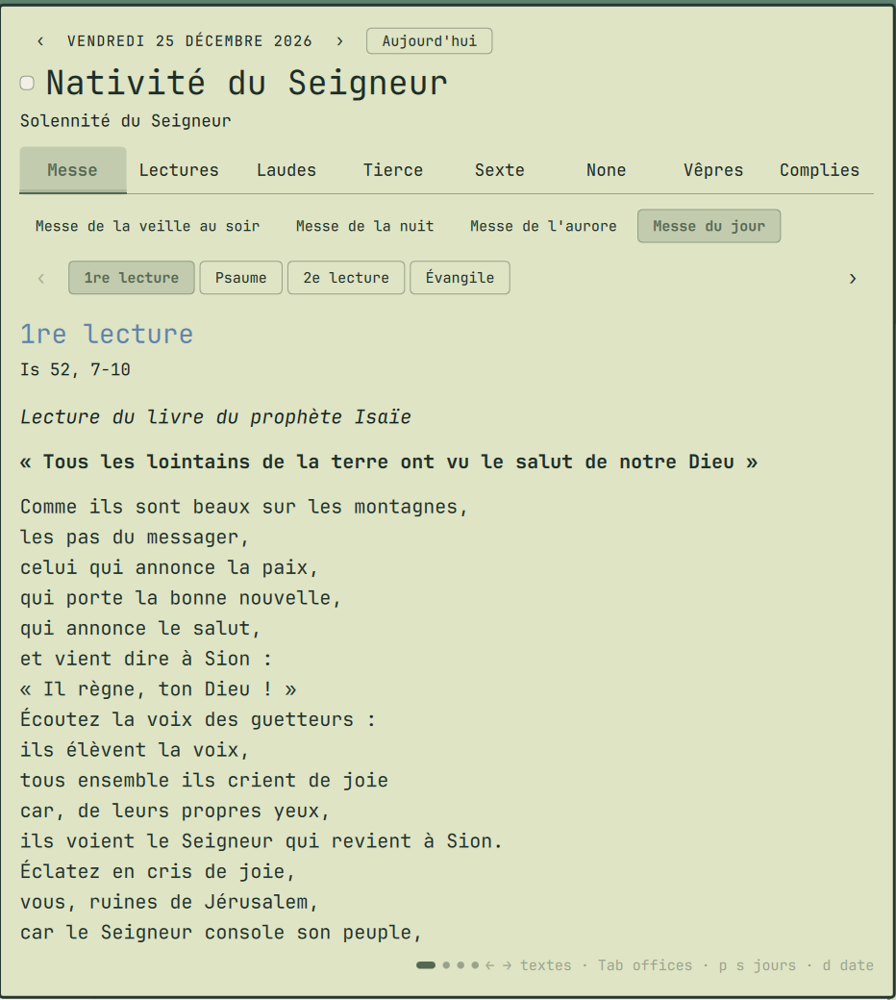

# AELF — lectures du jour pour Omarchy

Plugin du shell [Omarchy](https://omarchy.org/) : les lectures de la messe et la
prière des Heures du jour, en français, tirées de l'API officielle de l'[AELF](https://www.aelf.org)
(Association épiscopale liturgique pour les pays francophones).

*An Omarchy shell plugin showing today's Catholic Mass readings and Liturgy of
the Hours in French, from the official AELF API. A bar icon opens a reading panel.*



## Fonctionnement

Une icône dans la barre (infobulle : le jour liturgique) ouvre un panneau :

- En-tête : date, fête ou férie, pastille de la couleur liturgique.
- Onglets : Messe, Lectures, Laudes, Tierce, Sexte, None, Vêpres, Complies.
- Sous chaque onglet, un carrousel des textes (1re lecture, Psaume, Évangile ;
  psaumes, cantiques, oraison…) : un seul texte affiché à la fois.
  Les jours à plusieurs messes (Noël, Pâques…), on choisit laquelle.
- Navigation par date : `‹ ›`, bouton « Aujourd'hui », ou un clic sur la date
  pour en taper une : `25/12`, `2027-01-06`, `8 décembre`, `+7`, `demain`…
  L'AELF publie les textes environ neuf mois à l'avance.

| Touche | Action |
|--------|--------|
| `←` `→` (ou `h` `l`) | texte précédent / suivant |
| `Tab` / `Maj + Tab` | office suivant / précédent |
| `1` à `8` | aller directement à un office |
| `↑` `↓` (ou `j` `k`), `Espace` | faire défiler le texte |
| `p` / `s` | jour précédent / suivant |
| `a` | revenir à aujourd'hui |
| `d` | taper une date (`Entrée` valide, `Échap` annule) |
| `m` | messe suivante (jours à plusieurs messes) |
| `r` | recharger |
| `Échap` | fermer |

Clic droit sur l'icône : recharger.

## Installation

```bash
omarchy plugin add https://github.com/vianney-g/omarchy-aelf --enable
```

ou à la main :

```bash
git clone https://github.com/vianney-g/omarchy-aelf ~/.config/omarchy/plugins/io.github.vianney-g.aelf
omarchy plugin enable io.github.vianney-g.aelf --section right
```

## Désinstallation

```bash
omarchy plugin remove io.github.vianney-g.aelf
```

(ou `omarchy plugin disable io.github.vianney-g.aelf`, puis supprimer
`~/.config/omarchy/plugins/io.github.vianney-g.aelf`).

## Réglages

Facultatifs, dans l'entrée du widget de `~/.config/omarchy/shell.json` :

```json
{ "id": "io.github.vianney-g.aelf", "zone": "afrique", "fontSize": 16, "readingFont": "serif" }
```

- `zone` : calendrier liturgique — `afrique` (défaut), `france`, `belgique`,
  `canada`, `suisse`, `luxembourg`, `romain`.
- `fontSize` : taille du texte, en pixels (défaut : taille « title » du thème).
- `readingFont` : police des textes (défaut : police du thème).

Le panneau suit le thème Omarchy : police, arrondis, couleurs et états
(survol, sélection) des contrôles. Seule exception, voulue : la pastille de la
couleur liturgique du jour.

Raccourcis et scripts :

```bash
omarchy-shell shell toggle io.github.vianney-g.aelf      # ouvrir / fermer
omarchy-shell io.github.vianney-g.aelf open laudes       # un office précis
omarchy-shell io.github.vianney-g.aelf date 25/12        # une date
```

## Dépendances

`curl` (présent sur Omarchy) et un accès réseau à `api.aelf.org`. Aucune clé
d'API, aucun privilège, rien n'est écrit sur le disque.

## Textes liturgiques

Les textes affichés sont la propriété de l'AELF. Ce plugin ne les contient pas :
il les lit à la demande depuis l'API publique de l'AELF, gratuite pour un usage
non commercial, et ne les enregistre ni ne les redistribue.

## Licence

Code sous licence [MIT](LICENSE).
